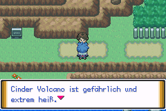
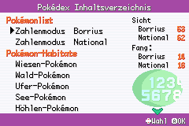
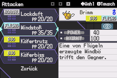
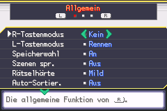

  

# Pokémon Unbound 2.1.1.1 auf Deutsch

Eine deutsche Übersetzung von **Pokémon Unbound**, dem GBA-ROM-Hack von
[Skeli789](https://discord.gg/k34Jm4T). Weitergegeben wird ausschließlich eine
Patchdatei, niemals ein ROM.

## [→ Patch herunterladen](Unbound_DE_uebersetzung.ups)

`Unbound_DE_uebersetzung.ups`, 1,4 MB. Wie du daraus ein spielbares ROM machst,
steht weiter unten unter [Einbau](#einbau).

---

## Bilder

| | |
| --- | --- |
|  |  |
|  |  |

Oben links ein Dialog. Ortsnamen wie `Cinder Volcano` bleiben absichtlich
englisch. Oben rechts das Inhaltsverzeichnis des Pokédex, unten links das
Attackenmenü mit den Beschreibungen, unten rechts die Einstellungen.

Auf dem Attackenbild sieht man auch die Grenze: Die Typ-Abzeichen links und
`POWER`/`ACCURACY` rechts sind Grafik und bleiben englisch. Der Text daneben
ist deutsch.

---

## Warum

Ich habe das für meine beiden Söhne gemacht. Der Ältere kommt mit dem
Englischen gerade so zurecht, hat mich aber im Minutentakt um Hilfe gefragt,
der Jüngere kam gar nicht rein.

Es ist deshalb **kein liebevoll von Hand gepflegtes Fan-Projekt**. Die
Übersetzung ist KI-gestützt, vieles habe ich nachgebessert, aber der Maßstab
war „meine Kinder können das spielen und haben Spaß dabei", nicht „das liest
sich wie eine offizielle Lokalisierung".

Zur Größenordnung: Es sind rund **237.000 Wörter**, etwa zweieinhalb Romane.
Ein Berufsübersetzer bräuchte dafür ungefähr ein halbes Jahr Vollzeit. Von
Hand war das für ein Feierabendprojekt nie eine Option.

---

## Zahlen

| | |
| --- | --- |
| Einträge im Bestand | 19.830 |
| Wörter (englisches Original) | 237.062 |
| Textstellen im ROM | 21.793 |
| davon deutsch geschrieben | 20.966 |
| gesperrt, weil es gar kein Text ist | 809 |
| noch englisch, weil der Platz fehlt | 18 |
| englischer Text noch im Spiel erreichbar | 16 |

Aufteilung des Bestands:

| | |
| --- | --- |
| Dialoge | 5.434 |
| Farb- und Kurztexte | 5.228 |
| Haupthandlung | 5.094 |
| Beschreibungen (Attacken, Items, Pokédex) | 2.419 |
| Namen und Menüs | 904 |
| Einfach-Text-Vokabeln und Rest | 457 |
| Art-Kategorien | 221 |
| Bausteinrahmen für zusammengesetzte Sätze | 40 |
| Bildschirmtitel | 14 |
| Kampfbausteine | 9 |
| Statusseiten-Rahmen | 5 |
| aus gesperrten Einträgen gerettete Sätze | 5 |

---

## Was gemacht wurde

**Auslesen.** Ein eigener Dumper, der byteweise nach Zeigern sucht statt nur
an durch vier teilbaren Adressen. CFRU bettet Skripte ein, deren
`loadpointer`-Operanden oft schief stehen. Allein diese eine Entscheidung
machte 5.481 Textstellen sichtbar, die sonst gefehlt hätten, darunter die
komplette Einführung.

**Übersetzen.** In Paketen, mit einer Prüfung nach jedem Paket: Platzhalter
vollständig, Steuerbefehle unverändert, Zeilen nicht breiter als im Original.

**Einpassen.** Der deutsche Satz ist im Schnitt länger als der englische, der
Platz im ROM aber fest. Rund 9.700 Texte wurden gekürzt, damit sie in ihr
vorhandenes Fach passen.

**Schreiben.** Vier Wege in fester Reihenfolge: gar nicht schreiben, an Ort
und Stelle überschreiben, kürzen bis es passt, und erst zuletzt verschieben.
Verschieben ist der riskanteste Weg und wurde portionsweise geprüft.

**Prüfen.** Der Maßstab ist nicht der Bestand, sondern das gebaute ROM: wie
viel englischer Text darin über einen gültigen Zeiger noch erreichbar ist.
Diese Zahl fiel von rund 9.000 über 750 und 276 auf zuletzt 16.

Ein Absturz hat mehrere Tage gekostet. Er kam nicht vom Übersetzen, sondern
davon, dass an einer Stelle Bewegungsdaten als Text ausgelesen wurden. Die
ganze Geschichte steht in **[ERKENNTNISSE.md](ERKENNTNISSE.md)**.

---

## Einschränkungen

### Die Typ-Symbole bleiben englisch

Auf der Statusseite und im Attackenmenü zeigt das Spiel die Typen als farbige
Symbole. Die sind **Grafik**, kein Text: `FIGHT`, `DRAGON`, `BUG` stehen dort
als Bild in den Kacheln. Dasselbe gilt für `POWER` und `ACCURACY`.

Überall dort, wo der Typ als Text erscheint, steht er deutsch: KAMPF, FLUG,
GIFT, BODEN, FELS, KÄFER, GEIST, STAHL, FEUER, WASSER, GRAS, BLITZ, PSYCHO,
EIS, DRACHE, DUNKEL.

### Absichtlich englisch

**Orts- und Personennamen.** Bellin Town bleibt Bellin Town, Antisis City
bleibt Antisis City. Wer online nach einer Komplettlösung sucht, findet sonst
nichts.

**Unbound-eigene Attacken und Fähigkeiten.** Dafür gibt es keinen offiziellen
deutschen Namen, und einen zu erfinden hilft niemandem.

**Der Abspann.** Namen von Menschen werden nicht übersetzt.

### Gekürzt, wo der Platz fehlte

Manche Sätze mussten kürzer werden als das Original, weil im ROM kein Byte
mehr frei war. Der Sinn bleibt, Beiwerk fällt weg:

| englisch | deutsch |
| --- | --- |
| `Ah, well...\nMy past hasn't changed.` | `Tja...\nGeändert hat sich nichts.` |
| `I couldn't focus with that guy\nnearby.` | `Der Kerl neben mir\nhat mich abgelenkt.` |
| `Many call me a maniac, but I prefer\nthe term "enthusiast".` | `Viele nennen mich verrückt,\nich lieber "Enthusiast".` |

### 18 Stellen ohne Chance

Dort beginnt mitten im Satz ein zweiter Eintrag, den das Spiel ebenfalls
anspringt. Für den deutschen Text bleiben dadurch ein bis zwei Bytes übrig.
`Obdachlosenheim` passt da nicht hinein.

### Spitznamen

Fängst du ein Pokémon, ohne ihm einen Namen zu geben, schreibt das Spiel den
Artnamen in diesem Moment fest in den Spielstand. Wer mitten im Spiel
wechselt, behält deshalb die englischen Namen der bereits gefangenen Pokémon.
Neu gefangene bekommen die deutschen.

---

## Einbau

Du brauchst drei Dinge, und zwei davon musst du dir selbst besorgen.

### 1. Pokémon Feuerrot

Die **US-Fassung 1.0**, CRC32 `DD88761C`. In Unbounds eigener Readme steht sie
als „Pokemon Fire Red (U)(Squirrels)". Hier gibt es sie nicht.

### 2. Pokémon Unbound 2.1.1

Skeli789s Patch auf Feuerrot anwenden. Ergebnis: CRC32 `4B3D4957`.

Den offiziellen Patch und die Anleitung dazu gibt es auf **[Unbounds
Discord](https://discord.gg/k34Jm4T)**. Das ist die Adresse, die Skeli789 in
seiner Readme selbst nennt. Dort stehen auch die bekannten Fehler und die
Mystery-Gift-Codes für die Pokémon, die man sonst nicht bekommt.

Skelis Anleitung empfiehlt **[Rom Patcher
JS](https://www.marcrobledo.com/RomPatcher.js/)**, das im Browser läuft und
nichts installiert.

Hast du Unbound schon, überspring diesen Schritt.

### 3. Diese Übersetzung

**[Unbound_DE_uebersetzung.ups](Unbound_DE_uebersetzung.ups)** auf dein
Unbound 2.1.1 anwenden. Ergebnis: CRC32 `1998B308`.

### Womit

Es muss **UPS** können. Lunar IPS und Floating IPS können das **nicht**, die
beherrschen nur IPS und BPS. Sie melden dann einen Fehler, der aussieht, als
wäre der Patch kaputt.

Passend sind Rom Patcher JS im Browser, NUPS unter Windows, MultiPatch auf dem
Mac und UniPatcher unter Android.

### Warum zwei Schritte

Ein Patch, der beides auf einmal macht, müsste Unbound selbst enthalten. Das
ist nicht meins zum Weitergeben.

Ein UPS-Patch trägt die Prüfsumme der erwarteten Ausgangsdatei in sich. Nimmst
du die falsche, bricht das Programm ab, statt dir stillschweigend eine kaputte
Datei zu bauen. Kommt am Ende `1998B308` heraus, ist alles richtig.

**Wenn dein Emulator abstürzt:** erst die Savestates löschen und das
automatische Laden abschalten. Ein Savestate aus dem englischen ROM enthält
Adressen, die im deutschen woanders liegen, und erzeugt Abstürze, die nichts
mit der Übersetzung zu tun haben.

Alles nochmal zum Mitnehmen in **[LIESMICH.txt](LIESMICH.txt)**, Prüfsummen in
**[PRUEFSUMMEN.txt](PRUEFSUMMEN.txt)**.

---

## Für andere Übersetzungsprojekte

**[ERKENNTNISSE.md](ERKENNTNISSE.md)**: dreizehn Abschnitte darüber, was beim
Auslesen und Zurückschreiben von GBA-Text schiefgeht. Unabhängig von der
Zielsprache und vom Spiel.

Der rote Faden: Fast jeder ernste Fehler kam nicht vom Übersetzen, sondern vom
Auslesen. Der Text war richtig übersetzt und byteweise korrekt geschrieben.
Nur war die Stelle, an die er geschrieben wurde, gar keine Textstelle.

---

## Fehler melden

Bitte mit Bildschirmfoto und der Prüfsumme deines ROMs. Und vorher die
Savestates prüfen, das erklärt erfahrungsgemäß die Hälfte.

---

## Rechtliches und Dank

Pokémon Unbound stammt von **Skeli789**. Diese Übersetzung ist eine
abgeleitete Arbeit. Sollte ihm die Weitergabe nicht recht sein, ziehe ich den
Patch auf Zuruf zurück.

Hier gibt es **kein ROM** und **kein Feuerrot**, nur die Differenz zwischen
englischem und deutschem Unbound. Bitte gib niemals ein fertig gepatchtes ROM
weiter, sondern nur die Patchdatei.

Pokémon ist eine Marke von Nintendo, Game Freak und Creatures.
